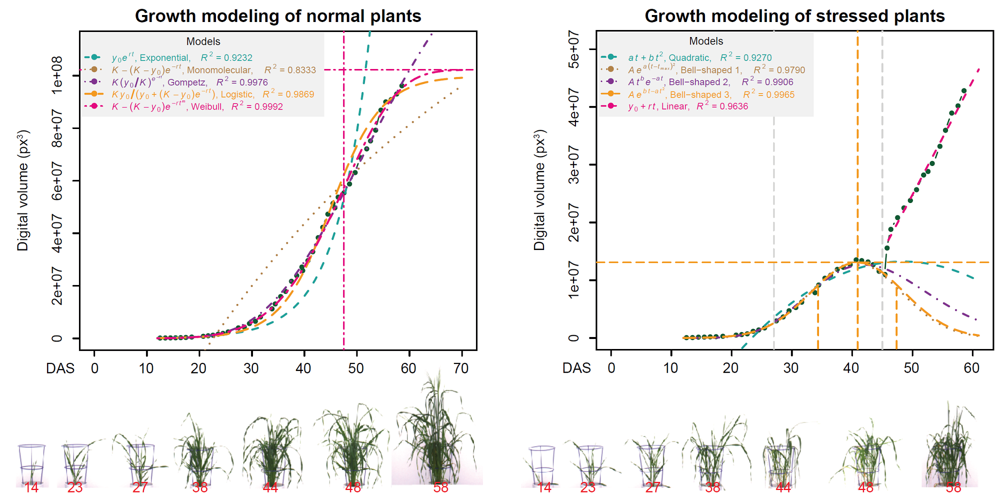
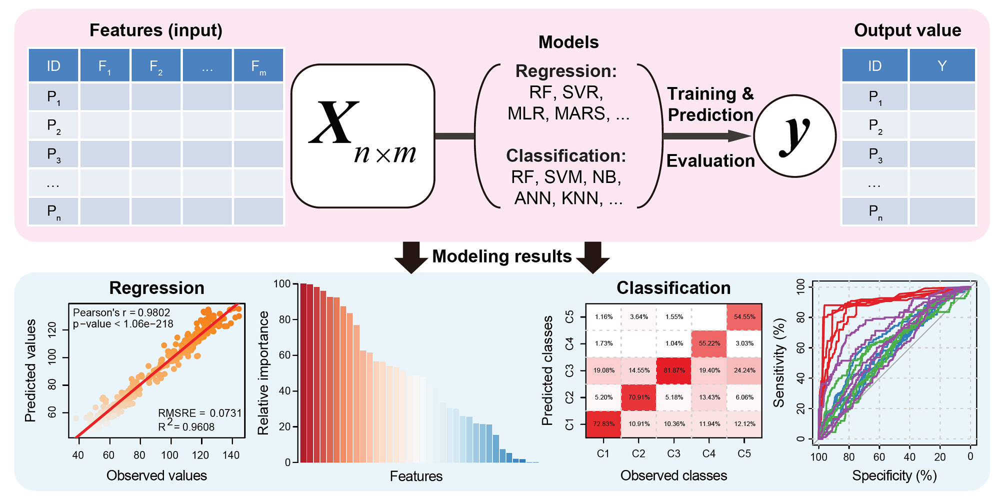
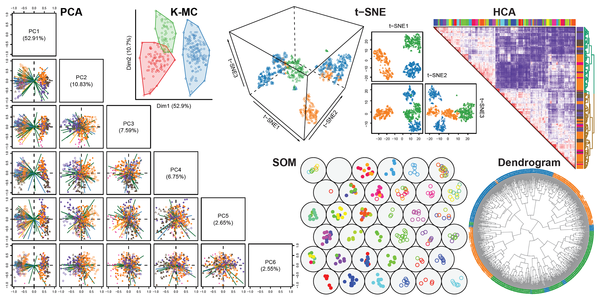

## HTPmod 
> ### A Shiny Application for Modeling and Visualization of Large-Scale Biological Data  
>> #### by Dijun Chen1,2, Liangyu Fu1, Dahui Hu3, Christian Klukas2, Ming Chen3 and Kerstin Kaufmann1
>> ##### 1 Department for Plant Cell and Molecular Biology, Institute for Biology, Humboldt-Universität zu Berlin, 10115 Berlin, Germany. 
>> ##### 2 Leibniz Institute of Plant Genetics and Crop Plant Research (IPK), Corrensstrasse 3, 06466 Gatersleben, Germany. 
>> ##### 3 Department of Bioinformatics, College of Life Sciences, Zhejiang University, Hangzhou 310058, China. 
>>> HTPmod is an interactive web tool for modeling and visualization of large-scale datasets from high-throughput plant phenotyping (HTP) or high-throughput sequencing (HTS) experiments. It consists of three function modules.

> > > * **`growMod`** was developed for plant growth modeling based on time-series data, e.g., from HTP experiments[1]. 

> > > * **`predMod`** was implemented with several prediction models that can be used to understand which among the independent measurements are related to the desirable target trait, and to dissect the forms of these relationships. For example, such prediction models have been widely used to model the contribution of chromatin features to the change of gene expression[2-7], and to predict plant biomass from image-derived features[8-12]. 

> > > * **`htpdVis`** was developed to explore and visualize high-dimensional data using machine learning approaches such as principal component analysis (PCA), t-distributed stochastic neighbor embedding (t-SNE), self-organizing map (SOM), multidimensional scaling (MDS), K-means clustering (K-MC) or hierarchical cluster analysis (HCA) with heatmap. 

> > > To get started, select `growMod`, `predMod` or `htpdVis` and read the instructions .

 
	<ol class="carousel-indicators">
		<li data-target="#carousel" data-slide-to="0" class="active"></li>
		<li data-target="#carousel" data-slide-to="1"></li>
		<li data-target="#carousel" data-slide-to="2"></li>
	</ol>
	

		
 
			

			    <h3>Plant Growth Modeling</h3>
                
Modeling of plant growth based on time-series data.

			

		

		
 
			

			    <h3>Prediction Models</h3>
                
Predicting important traits based on high-dimensional data.

			

		

		
 
		    

			    <h3>HT Data Visualization</h3>
                
Visualization of high-throughput data.

			

		

	

	<a class="left carousel-control" href="#carousel" role="button" data-slide="prev">  Previous </a>
	<a class="right carousel-control" href="#carousel" role="button" data-slide="next">  Next </a>

### Source code 
> Source code is available <a href="https://github.com/htpmod/" target="_blank">on GitHub</a>

### Contact us 
> chendijun2012@gmail.com

### How to cite 
> HTPmod: a Shiny Application for Modeling and Visualization of Large-Scale Biological Data 

[comment]: 

### References
> [1]Chen D, Neumann K, Friedel S, Kilian B, Chen M, Altmann T, Klukas C. Dissecting the phenotypic components of crop plant growth and drought responses based on high-throughput image analysis. The Plant Cell. 2014 Dec 1;26(12):4636-55. 

> [2]Cheng C, Alexander R, Min R, Leng J, Yip KY, Rozowsky J, Yan KK, Dong X, Djebali S, Ruan Y, Davis CA. Understanding transcriptional regulation by integrative analysis of transcription factor binding data. Genome research. 2012 Sep 1;22(9):1658-67. 

> [3]Cheng C, Gerstein M. Modeling the relative relationship of transcription factor binding and histone modifications to gene expression levels in mouse embryonic stem cells. Nucleic acids research. 2011 Sep 16;40(2):553-68.

> [4]Cheng C, Yan KK, Yip KY, Rozowsky J, Alexander R, Shou C, Gerstein M. A statistical framework for modeling gene expression using chromatin features and application to modENCODE datasets. Genome biology. 2011 Feb 16;12(2):R15.

> [5]Dong X, Greven MC, Kundaje A, Djebali S, Brown JB, Cheng C, Gingeras TR, Gerstein M, Guigó R, Birney E, Weng Z. Modeling gene expression using chromatin features in various cellular contexts. Genome biology. 2012 Sep 5;13(9):R53.

> [6]Karlić R, Chung HR, Lasserre J, Vlahoviček K, Vingron M. Histone modification levels are predictive for gene expression. Proceedings of the National Academy of Sciences. 2010 Feb 16;107(7):2926-31.

> [7]Song L, Huang SS, Wise A, Castanon R, Nery JR, Chen H, Watanabe M, Thomas J, Bar-Joseph Z, Ecker JR. A transcription factor hierarchy defines an environmental stress response network. Science. 2016 Nov 4;354(6312):aag1550.

> [8]Busemeyer L, Ruckelshausen A, Möller K, Melchinger AE, Alheit KV, Maurer HP, Hahn V, Weissmann EA, Reif JC, Würschum T. Precision phenotyping of biomass accumulation in triticale reveals temporal genetic patterns of regulation. Scientific reports. 2013 Aug 14;3:2442.

> [9]Chen D, Shi R, Pape JM, Klukas C. Predicting plant biomass accumulation from image-derived parameters. bioRxiv. 2016 Jan 1:046656. 

> [10]Fahlgren N, Feldman M, Gehan MA, Wilson MS, Shyu C, Bryant DW, Hill ST, McEntee CJ, Warnasooriya SN, Kumar I, Ficor T. A versatile phenotyping system and analytics platform reveals diverse temporal responses to water availability in Setaria. Molecular plant. 2015 Oct 5;8(10):1520-35.

> [11]Golzarian MR, Frick RA, Rajendran K, Berger B, Roy S, Tester M, Lun DS. Accurate inference of shoot biomass from high-throughput images of cereal plants. Plant Methods. 2011 Feb 1;7(1):2. 

> [12]Yang W, Guo Z, Huang C, Duan L, Chen G, Jiang N, Fang W, Feng H, Xie W, Lian X, Wang G. Combining high-throughput phenotyping and genome-wide association studies to reveal natural genetic variation in rice. Nature communications. 2014 Oct 8;5. 

 
